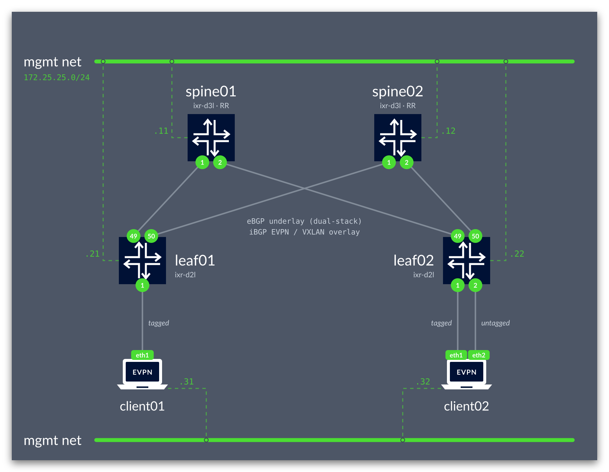
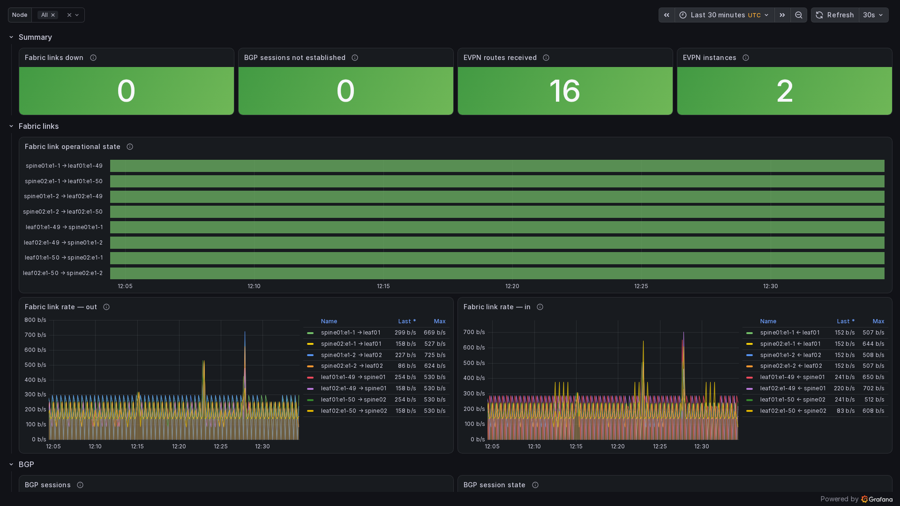
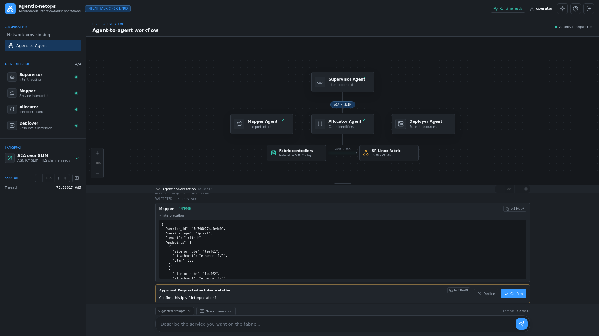
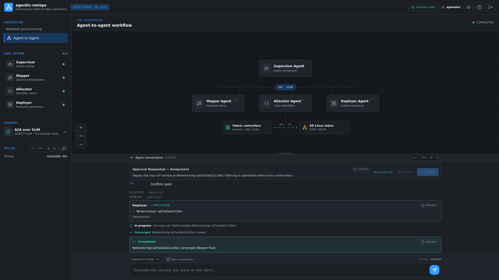

# agentic-netops-srl - Autonomous intent-to-fabric operations.

[](https://github.com/mairp/agentic-netops-srl/actions/workflows/ci.yaml)
[](.mergify.yml)
[](versions.lock.yaml)
[](versions.lock.yaml)
[-lightgrey)](docs/decisions/allocator-substitution.md)
[](versions.lock.yaml)
[](lab/topology.clab.yml)
[](TUTORIAL.md)

[](agents/supervisors/provisioning)
[](agents/supervisors/provisioning/graph)
[](agents/common/transport.py)
[](deploy/agents/slim.yaml)
[](deploy/observability/gnmic)
[](deploy/observability/prometheus)
[](deploy/observability/grafana/dashboards)

Autonomous intent-to-fabric operations. You state intent in plain language. A multi-agent tier
decomposes it, allocates identifiers and submits declarative resources. Kubernetes controllers
reconcile them onto a live SR Linux EVPN/VXLAN fabric and *keep* them that way: they re-verify
what they applied, report what drifted, and release what they claimed when intent is withdrawn.
There is one southbound. The provider renders an SDC `Config` for each device, and SDC applies it
over gNMI. No other path writes to a device.

The agent tier is not an add-on. It is how the network is driven: the fabric, the controllers and
the agents are three parts of one closed loop, with gNMI telemetry feeding back into it.

Everything below is self-contained: the instructions live here and in the documents it links.

## Demo

Full walkthrough (~2 min, 6x) — the intent tier end to end. Three services are
provisioned from plain-language prompts typed into the operator console: a **vlan**, an **ip-vrf**
with its prefix, and a **mac-vrf** stretched across both leaves. Each is confirmed through the
mapper and allocator agents and reported deployed. Each is then proven in the terminal, first with
`kubectl` (the `Network` resource `Ready`, its events, its spec) and then inside the SR Linux leaf
itself with read-only `info from state` reads. Those reads show the bridged network instance and
its subinterface, the `ip-vrf` with its VXLAN interface and its route for `10.55.0.0/24`, and the
`mac-vrf` on both leaves with its EVPN instance and the other leaf's VTEP. The console was logged in
before recording started. The prompts and every command line are frozen in
[docs/DEMO_VIDEO.md](docs/DEMO_VIDEO.md).

https://github.com/user-attachments/assets/e558ded9-d8a1-4fad-a4bb-2bb77c3ed9fc

Every "deployed" claim in the recording was re-verified from `kubectl` JSON; the collected evidence is in
[`docs/media/agentic-netops-srl-intent-tier-demo-evidence.json`](docs/media/agentic-netops-srl-intent-tier-demo-evidence.json).
From Enter to deployed took 29.7 s for the vlan, 37.1 s for the ip-vrf and 35.0 s
for the mac-vrf.

## The lab



Two spines (`ixr-d3l`), two leaves (`ixr-d2l`) and two Linux clients in containerlab, wired as a
Clos in the device's own port names ([lab/topology.clab.yml](lab/topology.clab.yml)); the badges
are the SR Linux `ethernet-1/N` port numbers. client02 has a second, untagged link on leaf02
`ethernet-1/2`. The underlay
is dual-stack eBGP on every fabric link. The overlay is iBGP EVPN from each leaf to both spines,
which reflect it, with VXLAN sourced from `system0.0`.



Live gNMI telemetry from the fabric. gNMIc subscribes to native SR Linux paths and exports OTLP to
the OpenTelemetry Collector, Prometheus stores it, and Grafana renders it
([deploy/observability](deploy/observability)).



The operator console during the recorded run (the ip-vrf prompt), logged in, with the mapper's
interpretation shown as JSON before anything is allocated. The sidebar shows each agent's readiness
from `/v1/health` and the A2A transport over AGNTCY SLIM; the canvas lights the agent the NDJSON
stream is on and animates the SLIM traffic while it talks. Every card carries the request's
correlation id. The **Suggested prompts** menu is what the supervisor serves on
`GET /suggested-prompts`: construct vocabulary naming only ports this site has
([agents/supervisors/provisioning/suggested_prompts.json](agents/supervisors/provisioning/suggested_prompts.json)).



The end of a transaction (the mac-vrf prompt). The outcome is reported as deployed only because every apply
succeeded and the `Network` then reported `Ready=True`. When convergence is still in flight at the
deployer's watch bound, the console says so, names the resource and ends in progress. It does not
report a success it has not observed.

**What works and what does not.**

- **All four constructs converge from plain language.** `vlan`, `mac-vrf`, `ip-vrf` and `acl` were
  each driven from a prompt to `Ready=True` on this lab by a session that had not read the
  implementation (the Phase 15 clean-host trial, 2026-09-29). The three constructs of the recording
  were driven the same way on 2026-09-29.
- **What `Ready=True` means here.** The provider reads back both sides. The written side is the
  `Config` and the device's running configuration. The applied side is operational state keyed to
  this service's own network instance, subinterfaces, tunnel and EVPN routes. A fabric-wide count is
  never used. The read-back is repeated on a schedule, so `Ready=True` is a statement about the
  fabric now, with `status.lastVerifiedTime` saying when.
- **What is refused before anything is submitted.** A node or port the site does not have (with
  the valid names listed), a named VLAN outside `100–999`, an untagged and a tagged attachment on
  one port, and any construct or property the qualification record does not show as qualified. The
  last one is refused by name ([docs/reference/qualification-record.md](docs/reference/qualification-record.md)).
- **Left unqualified by the capability gate: egress access lists.** An `acl` with `stage: egress` is
  refused by name at interpretation. Ingress access lists are qualified.
- **A one-shot request does not provision.** Nothing is claimed before the first confirmation and
  nothing is submitted before the second, so a single `POST /agent/prompt/stream` ends at the first
  confirmation request.
- **Both surfaces require a login.** The supervisor's pipeline routes and the console both take the
  generated operator credential, and every audit event carries the authenticated username.
- **An out-of-band change is reported, never reverted.** A `Network` edited or deleted with
  `kubectl` is reported as modified or deleted outside the intent tier. The tier writes nothing to
  it.
- **A deletion with a device away blocks.** It does not time out: the claims stay held and the
  unreachable target is named until the device returns, or until an operator force-releases with a
  stated reason, which leaves a durable finding.

The run-captured evidence behind these results is indexed in
[docs/media/p11-evidence-index.json](docs/media/p11-evidence-index.json).

## What you get

| Piece | What it is |
| --- | --- |
| Fabric | 2 `ixr-d3l` spines, 2 `ixr-d2l` leaves, 2 Linux clients in containerlab (`nokia_srlinux`); dual-stack eBGP underlay, iBGP EVPN/VXLAN overlay through route-reflecting spines |
| Controllers | the first-party fabric API (`Fabric`, `Network` in `fabric.agentic-netops.io/v1alpha1`) and `agentic-netops-srl-provider`, the only renderer of a device path; SDC applies what it renders over gNMI; identifiers come from the allocation authority the lock file selects |
| Observability | gNMIc → OTLP → OpenTelemetry Collector → Prometheus → Grafana, with fabric, EVPN service-path, physical-topology, orchestration and collector-health dashboards and the alert rules they are read with |
| Intent tier | AGNTCY supervisor with mapper, allocator and deployer agents over A2A/SLIM; the deployer runs the deployment transaction (translate → dry-run → apply → rollback → convergence watch) and reports what the cluster says |

## Prerequisites

- An x86-64 host with SSSE3 and a kernel of at least 4.10. Nested virtualisation (KVM) is not
  needed. Budget about 2 vCPU and 2 GiB of memory per SR Linux node, plus the Kind cluster and the
  intent tier. `scripts/lib/preflight.sh` checks this before it changes anything.
- Docker, containerlab, Kind and `kubectl`; every version the lab pins is in
  [versions.lock.yaml](versions.lock.yaml).
- **The management-CIDR overlap preflight.** The lab creates its own Docker network on `MGMT_CIDR`
  (default `172.25.25.0/24`). Provisioning stops before any change, naming the colliding Docker
  network, route, pod or service CIDR, if that range overlaps one. Pick another range with
  `MGMT_CIDR=…`.
- **The operator login.** The console and the supervisor take a generated credential. The username
  defaults to `operator` and the password is always generated, never read from a flag, a variable or
  a file. Both live in the Secret `agentic-netops-agents/operator-credentials`. They are lab
  credentials. [docs/operator-guide.md](docs/operator-guide.md) says how to read and rotate them.

## Quickstart

For a guided walk-through — including driving the agents from plain language — see
**[TUTORIAL.md](TUTORIAL.md)**.

```bash
# bring the fabric and the control plane up (idempotent; a second run changes nothing)
MGMT_CIDR=172.25.25.0/24 ./scripts/provision.sh --cluster-name agentic-netops

# verify
make verify-fabric-control-plane
make verify-pins

# tear down (idempotent; safe to re-run)
./scripts/off.sh --cluster-name agentic-netops
```

Add the agent tier:

```bash
# the model provider: these become Secret/llm-provider at provision time, never a manifest
export AGENTIC_NETOPS_LLM_MODEL="openai/gpt-5"     # or anthropic/…, azure/…
export AGENTIC_NETOPS_LLM_API_KEY="…"
export AGENTIC_NETOPS_LLM_BASE_URL="…"             # required for gateway providers
MGMT_CIDR=172.25.25.0/24 ./scripts/provision.sh --cluster-name agentic-netops --with-intent-tier

# the operator login, read from the generated Secret; the console is http://127.0.0.1:13000
OP_USER=$(kubectl -n agentic-netops-agents get secret operator-credentials -o jsonpath='{.data.username}' | base64 -d)
OP_PASS=$(kubectl -n agentic-netops-agents get secret operator-credentials -o jsonpath='{.data.password}' | base64 -d)
```

## Known limitations — read before trusting a run

These are real, recorded, and documented rather than hidden:

- **IPv6 anycast gateway and IPv6 Type-5 origination** are capability-gate items (G8). The gate
  observed both, and the qualification record publishes them qualified. A service whose IPv6 Type-5
  route is missing reports `Ready=False` naming that route, never `Ready=True` on its IPv4 half
  alone ([docs/reference/qualification-record.md](docs/reference/qualification-record.md)).
- **Egress access lists are unqualified** (gate item G9) and are refused by name. The pinned
  device-configuration layer does not accept the egress binding.
- **The containerized dataplane is not a throughput platform.** Nothing here asserts a rate. The
  traffic suites assert reachability, isolation, the MTU boundary and counter movement only.
- **The upstream allocation authority is dormant, and this lab runs its recorded substitute.** The
  lock file selects `allocationAuthority.kind: first-party`, with the decision record
  [docs/decisions/allocator-substitution.md](docs/decisions/allocator-substitution.md). Changing
  authority needs a lab with no bound claim
  ([docs/operations/allocation-authority.md](docs/operations/allocation-authority.md)).
- **Operator credentials are lab credentials.** They are generated per lab and shown in the Secret
  above. Nothing here is a production identity system.
- **SRv6 is deferred.** No SRv6 construct, path or render exists on this platform.
- **The offline schema validator refuses module-qualified identityrefs inside a `must`.** So
  `make verify-render-schema` normalizes them on a copy of the goldens before validating. That
  item stays open until a validator release accepts the goldens unmodified.
- **No pinned image lacks a build step.** Every upstream image resolves by digest in its registry,
  and every first-party image builds locally from `docker/` (`make verify-pins`).

## Repository layout

```
api/              the first-party API types (Fabric, Network; the conditional allocation kinds)
cmd/              srl-provider, migration-translator, intent-translator
controllers/      Fabric, Network, allocation and MigrationPlan reconcilers
internal/         model, SR Linux renderers, read-back, webhook, status, telemetry, topology view
pkg/              translator, typed read side, path register, SDC and allocation clients
config/           generated CRDs, RBAC, the Kind cluster
deploy/           cert-manager, SDC, KUID, allocation, provider, RBAC, observability, agents
lab/              containerlab topology, bootstrap configs, client setup
agents/           intent tier: supervisor, mapper, allocator, deployer, guards, tests and corpora
ui/               the operator console (login gate, agent-to-agent canvas, conversation)
docker/           the first-party Dockerfiles, every FROM by digest
scripts/          provision.sh, off.sh, lib/ (lifecycle phases, pins, evidence), ci/ (checks)
tests/            unit, golden, envtest, gate, integration and end-to-end suites
examples/         fabric, construct and migration examples
docs/             operator, operations and runbook guides; reference; decisions; media; images
versions.lock.yaml  every image, binary and host tool pin; enforced by `make verify-pins`
```

## Policies enforced in CI

**Jumbo MTU** — fabric ports run at 9412, the underlay IP MTU is 9398, and the tenant IP MTU is
9348, with the clients' interfaces set to 9348. The acceptance probes send ICMP payloads of 9320
bytes (IPv4) and 9300 (IPv6), which pass, and one byte more, which fails.

**Supply chain** — `make verify-pins` resolves every image digest against its registry and every
commit against its repository. It fails on any drift, placeholder, floating tag or branch
reference, and on a host tool whose version differs from the one recorded.

**Evidence** — a result counts only as captured by the run that claims it, with a negative control
recorded for every readiness check. `make verify-evidence` fails on a missing field, a post-edit or
a missing control.
